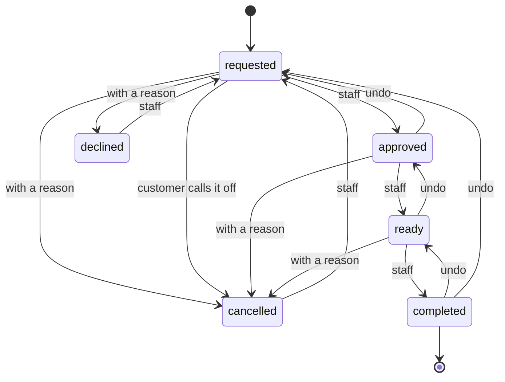

# The life of an order

This document exists to be maintained alongside the code. Order handling is the
largest piece of behaviour in the platform, and it lives in pieces — a
transition table, a payment axis, a notification rule, a document store, a mail
layer — each small and readable on its own, none of them saying what an order's
life actually looks like. Somebody changing one of those pieces needs to see
what else moves when they do.

So what follows is a detailed account of the logic **as it currently stands**,
not of the thinking behind it: the states an order has, who may move it between
them, and what each move does to the money, to the customer's own view of the
order, to what they can open and to what arrives in their inbox. The reasoning
lives in the ADRs; the requirements live in `requirements.md`.

**It has to be kept current.** Change a transition, a notification rule or a
mail template, and this document changes with it. The tables, the diagram and
the journey steps are generated (`npx nx order-lifecycle`), as is the email
gallery (`npx nx mail-previews`), and CI fails if either is stale — but the
prose around them is written by hand, and keeping it true is part of making the
change.

Requirements: FR-ORD-01…06 (the states, the moves, adjustments, payment,
documents), FR-NOTIF-03/05/06 (what gets written to whom), FR-WORK-01 (what a
customer's own panel flags). Decisions:
[ADR 0050](adr/0050-order-status-and-payment-state.md),
[ADR 0051](adr/0051-order-revisions.md),
[ADR 0052](adr/0052-order-documents-generated-or-supplied.md).

## Two axes, not one

Where an order **stands** and what it **owes** are separate facts, and they have
to be: cash is handed over with the goods, so a single chain could not say that
an order is finished and paid at the same moment as it says it was completed.
Fulfilment moves through the states below. Payment is `not-due`, `awaiting` or
`paid`, and only two things change it — accepting an order makes an invoiced one
due, and a manager records the money arriving.

A third fact sits underneath both: an order is a **thread of versions**. Every
move writes one, every adjustment writes one, and what the customer's own page
shows is a version — not necessarily the newest. So an order carries two
positions at once, both always stated to staff: the version the customer can
see, and the version they were last written to about.

## Where an order can go

<!-- generated:order-diagram -->

<!-- /generated:order-diagram -->

Every move runs backwards as well as forwards, one step at a time, for one
reason: staff's undo. A click made by accident must not leave an order at the
wrong answer for good, and the only other recovery from `ready` clicked too
early would be to cancel the order — which tells the customer their order was
called off when it never was.

The two endings are off the chain. Reopening a declined or cancelled order does
not put it back where it was: there is no telling which step it ended from, so
it goes back to `requested` and is answered again from the start.

<!-- generated:order-states -->

| Where the order stands | A manager may move it to               | The customer may | Invoiced order owes |
| ---------------------- | -------------------------------------- | ---------------- | ------------------- |
| `requested`            | `approved` · `declined` · `cancelled`  | `cancelled`      | `not-due`           |
| `approved`             | `ready` · `requested` · `cancelled`    | —                | `awaiting`          |
| `ready`                | `completed` · `approved` · `cancelled` | —                | `awaiting`          |
| `completed`            | `ready` · `requested`                  | —                | `awaiting`          |
| `declined`             | `requested`                            | —                | `not-due`           |
| `cancelled`            | `requested`                            | —                | `not-due`           |

<!-- /generated:order-states -->

The last column is what an invoiced order owes before anyone records a payment.
A cash order is never `awaiting`: cash exists at the handover, which is a
manager recording a payment and not a transition at all.

## Every move

<!-- generated:order-moves -->

| Move                      | Who      | Direction | Reason   | Mail offered |
| ------------------------- | -------- | --------- | -------- | ------------ |
| `requested` → `approved`  | staff    | forward   | —        | ticked       |
| `requested` → `declined`  | staff    | forward   | required | ticked       |
| `requested` → `cancelled` | staff    | forward   | required | ticked       |
| `requested` → `cancelled` | customer | forward   | optional | n/a          |
| `approved` → `ready`      | staff    | forward   | —        | ticked       |
| `approved` → `requested`  | staff    | backward  | —        | unticked     |
| `approved` → `cancelled`  | staff    | forward   | required | ticked       |
| `ready` → `completed`     | staff    | forward   | —        | ticked       |
| `ready` → `approved`      | staff    | backward  | —        | unticked     |
| `ready` → `cancelled`     | staff    | forward   | required | ticked       |
| `completed` → `ready`     | staff    | backward  | —        | unticked     |
| `completed` → `requested` | staff    | backward  | —        | unticked     |
| `declined` → `requested`  | staff    | forward   | —        | ticked       |
| `cancelled` → `requested` | staff    | forward   | —        | ticked       |

<!-- /generated:order-moves -->

**Direction** is not about the chain so much as about intent: it answers
whether staff are undoing a click. A refusal reads as `forward` for that reason
— declining an order is an answer the shop is giving, not a step it is taking
back — and only a move to an earlier state on the chain is `backward`.

**Reason** is required only for the shop's two refusals. A refusal is quoted at
the customer, and being told no without being told why is the answer nobody can
act on; a customer calling off their own order owes the shop nothing, so there
the reason is asked and not imposed.

**Mail offered** is the state of the tick box, not what happens. Nothing is ever
sent without a manager asking for it. The box is ticked for news the customer
has not had — a step forward to a state they have never been written to about —
and cleared for everything else, which is the shop putting its own record
straight. The column above shows the default for a customer who has been told
nothing yet; a second pass through a state they already had a mail about is
offered unticked.

An **adjustment** is not on this table at all. Changing what an order says has
its own payload and no target status: an adjusted order stands exactly where it
stood, including after it has ended.

## What an order deliberately cannot do

The states above are fewer than a B2B or retail platform usually has, and the
absences are decisions rather than gaps. A fuller account of what this platform
does not set out to support belongs in its own document; what follows is the
part that would otherwise be read as missing from this one.

- **No picking, packing or shipped states.** A small shop's fulfilment is a
  person walking to a shelf. States exist here so staff can say where an order
  is and so a customer can be told; splitting `ready` into a chain of handling
  steps would be recording a workflow nobody follows and nobody would keep up
  to date.
- **Nothing waits for money.** An accepted order is worked on whether or not it
  has been paid for. These are negotiated relationships with repeat customers
  on agreed terms, and gating fulfilment on payment would describe a shop that
  does not exist. Payment is tracked because it has to be known, not because
  anything branches on it.
- **No refund, and no `refunded` state.** A refund happens in the shop's books.
  The platform records that money arrived and lets a manager take that record
  back where it was recorded in error; money going the other way for a real
  reason is an event it does not model.
- **No stock is reserved.** Availability is a figure staff maintain — written
  by the sync or edited in the admin panel — and an order neither decrements it
  nor holds anything. An out-of-stock product cannot be ordered at all
  (FR-STOCK-04); everything short of that is a manager and a phone call.
- **No partial fulfilment, split shipment or backorder.** An order that cannot
  be filled as it stands is _changed_ — agreed with the customer, then written
  down as a new version — or refused. That is the same conversation those
  features exist to avoid, and this shop is having it anyway.
- **No carrier tracking, and no automatic transitions.** Every move is a person
  clicking, which is what makes the mail worth asking about rather than
  inferring. Online card payment (FR-CART-06) is the one automated transition
  the requirements anticipate, and it is not built yet.

The common thread is that a manager is in the loop for every order. States that
exist to coordinate machines with each other are cost without benefit here; the
ones that exist are the ones a person needs in order to say where an order is.

## What the customer receives

Every message the app can send is rendered in [the email gallery](mail.md) — both parts,
as the mailer sends them, from the demo wording. That gallery is the answer to
"what exactly does the customer get", and the subjects listed there are the
subjects the order-journey specs match on.

Three things decide which message a move produces: the status it lands on, the
notice (_moved_, _corrected_, _changed_), and whether the reader has an account.
An account holder is linked to their own order page; a guest gets the capability
token, which is their only record of the order.

## Journeys

An order's life is not one move but several, and the facts that matter most
only exist once they have accumulated: which version each side is on, what the
customer has already been written to about, whether a document filed two
versions ago still stands. The journeys below are walked against the running
API by `apps/api-e2e/src/api/order-journeys.spec.ts`, and this section is
rendered from the same literals — so nothing here is described that is not
checked, and nothing checked goes undescribed.

**What the columns say.**

<!-- generated:journey-legend -->

- **Where it stands** — The order’s fulfilment state, as staff see it.
- **What it owes** — The second axis: `not-due`, `awaiting` or `paid`. Independent of where the order stands.
- **Version** — How many versions the order has. Every move and every change writes one, so this counts what has happened to it.
- **The version the customer is on** — Which of those versions their own page shows. It can lag the newest one: a change nobody has told them about is not theirs to see.
- **Already written to about** — The statuses the customer has had a mail about, listed alphabetically rather than in the order they were sent. This is what decides whether the next move offers its tick box already ticked — a state on this list is not news twice.
- **The reason on it** — What the shop said when it refused the order, or the customer when they called it off. Cleared when an ended order is reopened.
- **The total the customer reads** — The money on the version they are on — not necessarily what the order now says.
- **What the customer can open** — The documents readable from their own page, which depends on the version they are on and on what the order owes. A file the shop put there in place of the generated one is marked `supplied`, and one the order has since moved on from `outdated`.
- **What the shop can open** — The same list from the admin side, which is not the same list: staff read whatever is filed, whenever it was filed, and see a supplied file marked `outdated` as soon as the order moves past the version it states.
- **Waiting for the customer** — How many of their orders their own panel is flagging — money owed, or a collection ready to be picked up. It is the marker they see on signing in. Blank for a guest, who has no panel and hears from the shop only by mail.
- **Mail to the customer** — What arrived in their inbox at this step, named by the message it is. An empty cell means nothing was sent, and is asserted.

<!-- /generated:journey-legend -->

**A blank cell is an assertion.** Every step asserts the whole observable state,
not only what it names: a reading nobody mentions is asserted unchanged, and a
mail nobody declares is asserted not to have been sent. That is what makes the
quiet steps below say something.

**These are examples, not a census.** Ten journeys cannot cover the
combinations an order allows — six states, moves in both directions,
adjustments at any point, two kinds of document, a reader who may or may not
have an account. What is chosen here is the accumulated state no other journey
reaches; the exhaustive per-move rules are in
`apps/api-e2e/src/api/orders.spec.ts`, and the table above is the complete
answer to what is allowed. A constellation nobody has written down is not
thereby forbidden — it is simply undocumented, and worth adding here if it ever
matters.

<!-- generated:order-journeys -->

<b>Delivered, invoiced, and paid on the doorstep</b> — The whole forward chain for a signed-in customer, and the one journey that walks it end to end. Everything else starts partway along.

**The order.** A signed-in customer’s order, for delivery and invoiced to their company.

**Starting from.** It has just been placed.

**Which leaves it.** Where it stands: `requested` What it owes: `not-due` Version: 1 The version the customer is on: 1 Already written to about: `requested`

| #   | What happens                                                                   | Who     | What changes                                                                                                                                                                                                                                                                         |
| --- | ------------------------------------------------------------------------------ | ------- | ------------------------------------------------------------------------------------------------------------------------------------------------------------------------------------------------------------------------------------------------------------------------------------ |
| 1   | The manager checks the stock and accepts the order.                            | manager | Where it stands: `approved` What it owes: `awaiting` Version: 2 The version the customer is on: 2 Already written to about: `approved` · `requested` Mail to the customer: [`approved`](mail.md#order-approved) Waiting for the customer: 1                        |
| 2   | The order is packed, and the manager marks it ready.                           | manager | Where it stands: `ready` Version: 3 The version the customer is on: 3 Already written to about: `approved` · `ready` · `requested` Mail to the customer: [`readyDelivery`](mail.md#order-ready-delivery)                                                                 |
| 3   | It is handed over and paid for, which the manager records with the same click. | manager | Where it stands: `completed` What it owes: `paid` Version: 4 The version the customer is on: 4 Already written to about: `approved` · `completed` · `ready` · `requested` Mail to the customer: [`completed`](mail.md#order-completed) Waiting for the customer: 0 |

<b>A step taken back, and taken again</b> — What the customer is *not* told. Walking a move back and repeating it must not write to them twice about a step they have already had — and must not make the genuinely new one quiet.

**The order.** The same order, already packed: accepted and marked ready, both announced.

**Starting from.** The manager accepts it. The manager marks it ready.

**Which leaves it.** Where it stands: `ready` Version: 3 The version the customer is on: 3 Already written to about: `approved` · `ready` · `requested`

| #   | What happens                                                        | Who     | What changes                                                                                                                                                                                                                  |
| --- | ------------------------------------------------------------------- | ------- | ----------------------------------------------------------------------------------------------------------------------------------------------------------------------------------------------------------------------------- |
| 1   | `ready` was clicked too early, so the manager walks it back a step. | manager | Where it stands: `approved` Version: 4 The version the customer is on: 4                                                                                                                                                |
| 2   | The order is genuinely ready, and the manager says so again.        | manager | Where it stands: `ready` Version: 5 The version the customer is on: 5                                                                                                                                                   |
| 3   | It is handed over and completed.                                    | manager | Where it stands: `completed` Version: 6 The version the customer is on: 6 Already written to about: `approved` · `completed` · `ready` · `requested` Mail to the customer: [`completed`](mail.md#order-completed) |

<b>Collected from the counter, paid in cash</b> — The other shape of an order: a guest with no account, collecting rather than receiving, paying at the handover. Cash is the case a single status chain could not describe.

**The order.** A guest’s order, to be collected from an office and paid for in cash.

**Starting from.** It has just been placed.

**Which leaves it.** Where it stands: `requested` What it owes: `not-due` Version: 1 The version the customer is on: 1 Already written to about: `requested`

| #   | What happens                                                                    | Who     | What changes                                                                                                                                                                                                                                          |
| --- | ------------------------------------------------------------------------------- | ------- | ----------------------------------------------------------------------------------------------------------------------------------------------------------------------------------------------------------------------------------------------------- |
| 1   | The manager accepts it.                                                         | manager | Where it stands: `approved` Version: 2 The version the customer is on: 2 Already written to about: `approved` · `requested` Mail to the customer: [`approved`](mail.md#order-approved)                                                    |
| 2   | It is packed, and waiting at the counter.                                       | manager | Where it stands: `ready` Version: 3 The version the customer is on: 3 Already written to about: `approved` · `ready` · `requested` Mail to the customer: [`readyPickup`](mail.md#order-ready-pickup)                                      |
| 3   | The customer collects it and pays, which the manager records with the handover. | manager | Where it stands: `completed` What it owes: `paid` Version: 4 The version the customer is on: 4 Already written to about: `approved` · `completed` · `ready` · `requested` Mail to the customer: [`completed`](mail.md#order-completed) |

<b>Changed after it was accepted</b> — An order and the customer’s copy of it are two positions, and a change moves only one of them. Nothing reaches the customer until somebody says it should.

**The order.** A signed-in customer’s order, already accepted.

**Starting from.** The manager accepts it.

**Which leaves it.** Where it stands: `approved` What it owes: `awaiting` Version: 2 The version the customer is on: 2

| #   | What happens                                                                        | Who     | What changes                                                                                                                                                                                                         |
| --- | ----------------------------------------------------------------------------------- | ------- | -------------------------------------------------------------------------------------------------------------------------------------------------------------------------------------------------------------------- |
| 1   | Short of stock, the shop agrees a smaller quantity on the phone and writes it down. | manager | Version: 3                                                                                                                                                                                                           |
| 2   | The manager confirms the change in writing.                                         | manager | The version the customer is on: 3 The total the customer reads: 1999 Mail to the customer: [`changed`](mail.md#order-changed)                                                                                  |
| 3   | The smaller order is packed and marked ready.                                       | manager | Where it stands: `ready` Version: 4 The version the customer is on: 4 Already written to about: `approved` · `ready` · `requested` Mail to the customer: [`readyDelivery`](mail.md#order-ready-delivery) |

<b>Refused, then answered again</b> — A refusal is quoted at the customer and keeps the order. Reopening it is staff putting their own record right, which is why it is quiet unless somebody says otherwise.

**The order.** A signed-in customer’s order the shop cannot fill.

**Starting from.** It has just been placed.

**Which leaves it.** Where it stands: `requested` The reason on it: null Version: 1

| #   | What happens                                                       | Who     | What changes                                                                                                                                                                                                                                                               |
| --- | ------------------------------------------------------------------ | ------- | -------------------------------------------------------------------------------------------------------------------------------------------------------------------------------------------------------------------------------------------------------------------------- |
| 1   | The manager declines it, saying why.                               | manager | Where it stands: `declined` The reason on it: `Out of stock until October.` Version: 2 The version the customer is on: 2 Already written to about: `declined` · `requested` Mail to the customer: [`declined`](mail.md#order-declined)                      |
| 2   | The stock arrives sooner than expected, so the manager reopens it. | manager | Where it stands: `requested` The reason on it: null Version: 3 The version the customer is on: 3                                                                                                                                                                  |
| 3   | The manager accepts it, and this time says so deliberately.        | manager | Where it stands: `approved` What it owes: `awaiting` Version: 4 The version the customer is on: 4 Already written to about: `approved` · `declined` · `requested` Mail to the customer: [`approved`](mail.md#order-approved) Waiting for the customer: 1 |

<b>Called off by the customer</b> — The one move a customer has, and the one thing the shop must not do about it: write to them about something they just did themselves.

**The order.** A signed-in customer’s order, still waiting for an answer.

**Starting from.** It has just been placed.

**Which leaves it.** Where it stands: `requested` What it owes: `not-due` Version: 1

| #   | What happens                                  | Who      | What changes                                                                                                                     |
| --- | --------------------------------------------- | -------- | -------------------------------------------------------------------------------------------------------------------------------- |
| 1   | The customer calls the order off, saying why. | customer | Where it stands: `cancelled` The reason on it: `Ordered twice by mistake.` Version: 2 The version the customer is on: 2 |

<b>The payment slip, and who may open it</b> — A document is filed against a version. Until the customer’s own page reaches that version they are not offered it — which is the rule that stops a file describing a change nobody has told them about.

**The order.** A signed-in customer’s order, invoiced and already accepted.

**Starting from.** The manager accepts it.

**Which leaves it.** Where it stands: `approved` What it owes: `awaiting` Version: 2 The version the customer is on: 2 What the customer can open: `order-summary`

| #   | What happens                                                            | Who     | What changes                                                                                                                                                                                                         |
| --- | ----------------------------------------------------------------------- | ------- | -------------------------------------------------------------------------------------------------------------------------------------------------------------------------------------------------------------------- |
| 1   | A line is repriced, and the customer is not told yet.                   | manager | Version: 3                                                                                                                                                                                                           |
| 2   | The shop files the payment instructions for the order as it now stands. | manager | What the shop can open: `order-summary` · `payment-instructions`                                                                                                                                                     |
| 3   | The manager confirms the change, which brings the slip with it.         | manager | The version the customer is on: 3 The total the customer reads: 1999 What the customer can open: `order-summary` · `payment-instructions` Mail to the customer: [`changed+attached`](mail.md#order-changed) |

<b>Corrected after it was finished</b> — What the platform records is what the shop did — including a correction to an order that ended weeks ago. Correcting one must not reopen it, and must not announce a lap of the workflow nobody took.

**The order.** A signed-in customer’s order, delivered and completed.

**Starting from.** The manager accepts it. The manager marks it ready. The manager completes it.

**Which leaves it.** Where it stands: `completed` Version: 4 The version the customer is on: 4 Already written to about: `approved` · `completed` · `ready` · `requested`

| #   | What happens                                                          | Who     | What changes                                                                                  |
| --- | --------------------------------------------------------------------- | ------- | --------------------------------------------------------------------------------------------- |
| 1   | A wrong contact name is noticed on the finished order, and put right. | manager | Version: 5                                                                                    |
| 2   | The manager decides this one is worth telling them about.             | manager | The version the customer is on: 5 Mail to the customer: [`changed`](mail.md#order-changed) |

<b>Invoiced, with the instructions in the acceptance</b> — What a company order is for: the shop files its payment instructions first, so accepting the order and telling the customer how to pay are one message and not two.

**The order.** A signed-in customer’s order, invoiced to their company and paid by transfer.

**Starting from.** It has just been placed.

**Which leaves it.** Where it stands: `requested` What it owes: `not-due` What the customer can open: `order-summary` What the shop can open: `order-summary` Waiting for the customer: 0

| #   | What happens                                            | Who     | What changes                                                                                                                                                                                                                                                                                                                                                     |
| --- | ------------------------------------------------------- | ------- | ---------------------------------------------------------------------------------------------------------------------------------------------------------------------------------------------------------------------------------------------------------------------------------------------------------------------------------------------------------------- |
| 1   | The shop files the payment instructions for this order. | manager | What the shop can open: `order-summary` · `payment-instructions`                                                                                                                                                                                                                                                                                                 |
| 2   | The manager accepts the order.                          | manager | Where it stands: `approved` What it owes: `awaiting` Version: 2 The version the customer is on: 2 Already written to about: `approved` · `requested` What the customer can open: `order-summary` · `payment-instructions` Waiting for the customer: 1 Mail to the customer: [`approved+attached`](mail.md#order-approved-with-instructions) |
| 3   | The transfer arrives, and the manager records it.       | manager | What it owes: `paid` Waiting for the customer: 0                                                                                                                                                                                                                                                                                                              |

<b>The shop’s own summary, and the order moving past it</b> — Every order has a summary; the platform draws it unless the shop files one instead. A supplied file is a snapshot, so the order can move on from it — and taking it back off restores the drawn one.

**The order.** A signed-in customer’s order, still waiting for an answer.

**Starting from.** It has just been placed.

**Which leaves it.** Where it stands: `requested` What the customer can open: `order-summary` What the shop can open: `order-summary`

| #   | What happens                                                  | Who     | What changes                                                                                                 |
| --- | ------------------------------------------------------------- | ------- | ------------------------------------------------------------------------------------------------------------ |
| 1   | The shop files its own summary in place of the drawn one.     | manager | What the customer can open: `order-summary (supplied)` What the shop can open: `order-summary (supplied)` |
| 2   | A line is repriced, which the filed summary no longer states. | manager | Version: 2 What the shop can open: `order-summary (supplied, outdated)`                                   |
| 3   | The manager takes the filed summary back off.                 | manager | What the customer can open: `order-summary` What the shop can open: `order-summary`                       |

<!-- /generated:order-journeys -->
